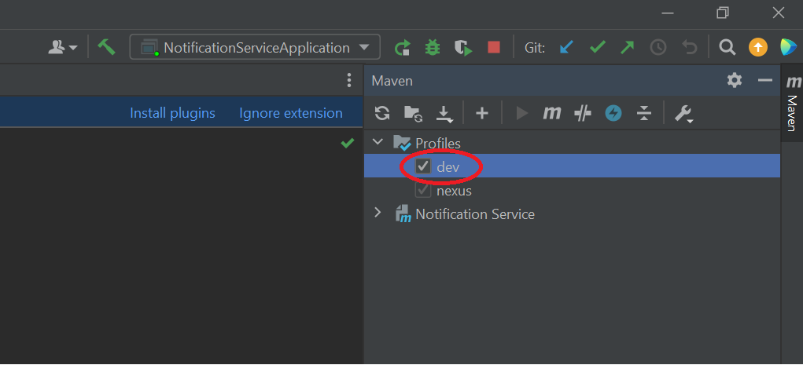
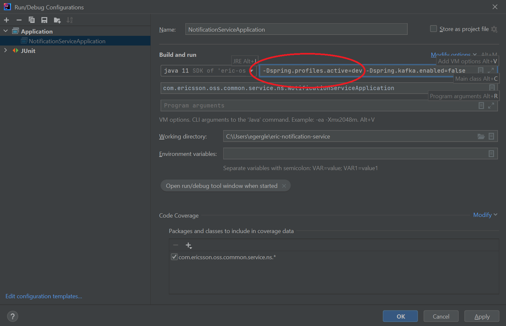
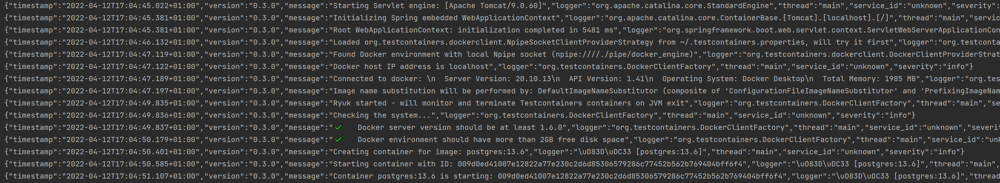

# Ericsson Notification Service

The Notification Service provides a mean within the application to collect events published on a message bus and dispatch them to clients. 

Notifications are sent only to clients which have at least a subscription matching with a set of criteria defined in the subscription itself.

Clients can be either _External_ and _Internal_ in relation to EO or IDUN.

Notification Service exposes REST API for: 

- Creating a subscription
- Deleting a subscription
- Getting a subscription by id
- Getting all subscriptions

---
# Community

## Contribution
See [guidelines](CONTRIBUTING.md)

# How to get the notification service
You can download the business logic source code and the supporting repos as follows:

##### Business logic

`git clone ssh://<your-signum>@gerrit.ericsson.se:29418/OSS/com.ericsson.oss.common.service/eric-notification-service`

##### API

`git clone ssh://<your-signum>@gerrit.ericsson.se:29418/OSS/com.ericsson.oss.common.service/eric-notification-service-api`

##### Integration tests

`git clone ssh://<your-signum>@gerrit.ericsson.se:29418/OSS/com.ericsson.oss.common.service/eric-notification-service-testsuite`

# How to use the notification service
Tutorials on how to use the service and the architecture overview can be found in [doc](/doc)

# Contact Information

Photon Team ("Team Photon" <pdleowanop@pdl.internal.ericsson.com>)

#### PO

Massimo La Rosa (Photon Team) (massimo.larosa@ericsson.com)

#### Team Members - Photon Team

Sabrina Lettere (SM) (sabrina.lettere@ericsson.com)

Gianmarco Bruno (gianmarco.bruno@ericsson.com)

Juan Flores (juan.carlos.flores.mendoza@ericsson.com)

Paolo Franceschini (paolo.franceschini@ericsson.com)

Marco Marchesini (marco.a.marchesini@ericsson.com)

Riccardo Pirastru (riccardo.pirastru@ericsson.com)

Sahitya Reddy Bollavaram (sahitya.reddy.bollavaram@ericsson.com)

### Service

#### CI Pipeline

The microservice pre-codereview and Jenkins jobs are respectively:

https://fem2s11-eiffel052.eiffel.gic.ericsson.se:8443/jenkins/view/EO-Photon/job/eric-message-notification_precodereview/

https://fem2s11-eiffel052.eiffel.gic.ericsson.se:8443/jenkins/view/EO-Photon/job/eric-message-notification_publish/

The integration Jenkins job is run automatically by the Spinnaker pipelines:

https://fem2s11-eiffel052.eiffel.gic.ericsson.se:8443/jenkins/view/EO-Photon/job/eric-message-notification_integration/

The 3pp analysis is performed by the homemade "3pp-analysis" tool.
Its image is stored in: armdocker.rnd.ericsson.se/sandbox/photon/3pp:<version>
Its source code can be found in gerrit:

`git clone ssh://<your-signum>@gerrit.ericsson.se:29418/WANO/Overlay/3pp-analysis.git`

#### Maven Dependencies
The Notification Service has the following Maven dependencies (only main are listed):
  - Java 11
  - Notification Service API
  - Spring Boot Starter Parent
  - Spring Boot Starter JDBC
  - Spring Boot Starter Web
  - Spring Boot Starter Test
  - Postgresql
  - Flyway
  - TestContainers
  - Micrometer
  - [EO Common Logging] utility for logback created by Laika team
  - JaCoCo Code Coverage Plugin
  - Sonar Maven Plugin

## Build related artifacts
The main build tool is BOB provided by ADP. For convenience, maven wrapper is provided to allow the developer to build in an isolated workstation that does not have access to ADP.
  - [ruleset2.0.yaml](ruleset2.0.yaml) - for more details on BOB please click here [BOB].
  - [precode.Jenkinsfile](Jenkinsfile) - For pre code review Jenkins pipeline that runs when patch set is pushed.
  - [publish.Jenkinsfile](publish.Jenksinfile) - For publish Jenkins pipeline that runs after patch set is merged to master.

If the developer wishes to manually build the application in the local workstation, the command ``` bob release ``` can be used once BOB is configured in the workstation.

## Containerization and Deployment to Kubernetes cluster.
Following artifacts contains information related to building a container and enabling deployment to a Kubernetes cluster:
- [charts](charts/) folder - used by BOB to lint, package and upload helm chart to helm repository.
  - Once the project is built in the local workstation using the ```bob release``` command, a packaged helm chart is available in the folder ```.bob/notification-service-internal/``` folder. This chart can be manually installed in Kubernetes using ```helm install``` command. [P.S. required only for Manual deployment from local workstation]
  - Released the Notification Service Helm packages can be found at `https://arm.seli.gic.ericsson.se/artifactory/proj-eo-drop-helm-local/proj-eric-notification-service-drop-helm/eric-oss-notification-service/`
- [Dockerfile](Dockerfile) - dockerfile is used to build docker image. Based on a `sles` image. The Notification Service docker images can be found at `armdocker.rnd.ericsson.se/proj-eo/common/proj-notification-service-drop/eric-oss-notification-servic`


## Running Notification Service in IDE with Postgres database
This project contains a maven profile called dev. This maven profile is used to bring in dependencies to automatically start a postgres database for developer starting the spring application. These dependencies are not used with the service and are purely used for development.
To start the postgres database you will need docker installed on your machine.

Please use the following steps:
 - In your IDE select the maven profile dev to enabled. i.e. in Intellij click dev option in the maven sidebar.
   
 - When starting the application set the spring profile in VM options to dev i.e. -Dspring.profiles.active=dev. You do not need to set any database parameters as it will create a datasource automatically.
   

When the application starts you will see in the logs a postgres database starting up


When the application stop the database will also be stopped.

## Source code repositories and Sonarqube dashboard

Notification Service code base:

<https://gerrit.ericsson.se/#/admin/projects/OSS/com.ericsson.oss.common.service/eric-notification-service>

Notification Service API:

<https://gerrit.ericsson.se/#/admin/projects/OSS/com.ericsson.oss.common.service/eric-notification-service-api>

Notification Service Integration Testsuite:

<https://gerrit.ericsson.se/#/admin/projects/OSS/com.ericsson.oss.common.service/eric-notification-service-testsuite>

EO Common Logging:

<https://confluence-oss.seli.wh.rnd.internal.ericsson.com/display/ESO/EO+Common+Logging+Library>

Notification Service SonarQube Dashboard:

<https://sonarqube.lmera.ericsson.se/dashboard?id=eric-eo-notification-service>
