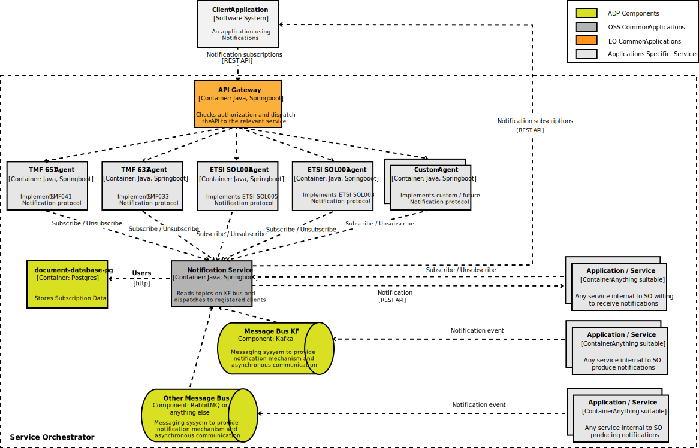
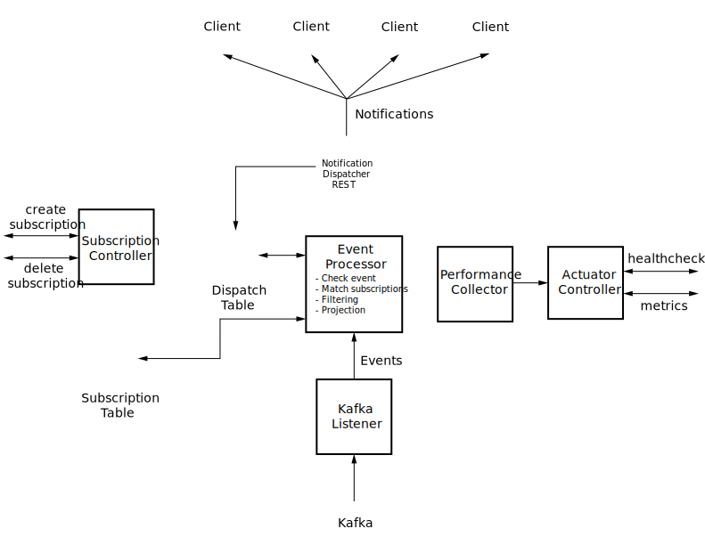

# Notification Service Concepts

---

This section describes key concepts and terminology you need to understand to use
the Ericsson Notification Service (ENS) effectively. Where possible, they are presented in
the order that you will most likely encounter them.

  - [Producers](#producers)
  - [Clients](#clients)
  - [Events](#events)
  - [Subscriptions](#subscriptions)
  - [Notifications](#notifications)
  - [How Notification Service Works](#how-notification-service-works)
  - [Architecture](#architecture)

The Notification Service collects **events** that are published by other services or applications (**producers**) on a Kafka 
message bus and distributes them as REST messages, called **notifications**, to a set of subscribed **clients**.

Therefore the actors in the Notification Service scenarios are event producing services (producers) 
and notification receiving services (clients).
The ENS resource model consists of events, subscriptions and notifications.

**Note 1**: The initial message bus being supported is Kafka. Additional message bus types such as Redis, RabbitMQ and other will be supported in the future.
<!-- line break -->

**Note 2**: In the future, the events that are read from the message bus will be processed and reported also as e-mail or SMS, or by other methods. 

##  Producers

Producers send messages, which are called events to the Notification Service through the Kafka Message Bus. Notification Service can receive events on a specific Kafka topic. For more information, see Kafka documentation.

##  Clients

Clients can register themselves to Notification Service by creating **subscriptions**. A subscription is a record that is stored in the Notification Service database. It includes information about the registered client and the events the client wants to receive. For more information see the "Subscriptions" section.
Notifications are sent only to clients which have at least one subscription 
matching an event through a set of criteria defined in the subscription itself.

Clients can be either:

- **External**: applications outside the perimeter of the system using the 
notification service, for example SO/IDUN. These external applications must access agent services; an agent is responsible for managing a specific protocol (for example TMF or ETSI) and is also responsible for the external connection security. 
Agents convert the specific protocols supported by the clients to create, retrieve and delete  subscriptions into the Notification Service protocol.
- **Internal**: services or applications inside the perimeter of the system 
using the Notification Service. In this case, agents and security aspects are not required. Services can register directly to the Notification Service without using an agent and receive notifications without any special security mechanism.
<!-- line break -->

A possible scenario of usage of the Notification Service inside SO is shown 
in the following schema:

**Note**: This diagram shows a simplified schema for your understanding. Remember that any internal service could be both client and producer and the agents could be event producers as well.
<!-- line break -->

##  Events

Events are messages that are delivered into the Kafka message bus over a specified topic. The topic is configurable, the default topic is “event”. Events are read by the ENS and processed to produce and distribute notifications to the registered clients. The events have a fixed structure:

| Field Name | Type     | Description                                                             | Presence  |
|------------|----------|-------------------------------------------------------------------------|-----------|
| `eventID`    | String   | Unique identifier of the event.                                          | Mandatory |
| `descriptor` | String   | The detailed description of the event that is provided by the event producer. | Optional  |
| `eventType`  | String   | The type of the event.                                                       | Mandatory |
| `tenant`     | String   | The tenant associated with the event. To specify no tenant, the tenant field must be populated with an empty string. | Mandatory |
| `eventTime`  | DateTime | The date and time the event occurred.                                           | Mandatory |
| `payLoad`    | String   | The body of the event. It is JSON encoded.                                               | Mandatory |
|`additionalInformation` | String | JSON encoded, additional information of the event.               | Optional |

 Table 1 - Event Structure 

<!-- line break -->

##  Subscriptions

Subscriptions are registered by the clients to inform ENS about the information that they want to receive. Subscriptions contain a 
set of conditions that the event must match so it can be further processed and generate a notification for the relevant
client. An endpoint of the client is also included. The notification is sent to this endpoint.

| Field Name         | Type     | Description                                                                  | Presence                    |
|--------------------|----------|------------------------------------------------------------------------------|-----------------------------|
| `id`                 | UUID     | A unique UUID identifier generated by ENS when a new subscription is created. | Not specified in creation   |
| `address`            | URL      | The endpoint where the notifications are sent.                       | Mandatory                   |
| `tenant`             | String   | The tenant that the event must have to match the subscription. If no tenant is expected, then the tenant field must be populated with an empty string.  | Optional (can be empty string but not null)       |
| `subscriptionFilter` | Array    | A set of filtering conditions that the event must match so it can be delivered.  | Mandatory (at least 1 item) |

 Table 2 - Subscription Structure 

<!-- line break -->
The elements of the subscriptionFilter have the following structure:

| Field Name     | Type   | Description                                                                | Presence  |
|----------------|--------|----------------------------------------------------------------------------|-----------|
| `eventType`      | String | The requested type of the event.                                            | Mandatory |
| `filterCriteria` | String | A boolean filter expression (in RSQL) that must be satisfied by the event payLoad. | Optional  |
| `fields`         | String | A list of paylaod fields to be copied into the notification.         | Optional  |

 Table 3 - Subscription Filter Structure 

<!-- line break -->

##  Notifications

The Notification Service collects the events received by the Kafka message bus and transforms them into notifications. 

A notification is a REST message posted to the client. Its content is the `payLoad` field of the relevant event. If a non-empty `fields` attribute is specified in the `subscriptionFilter` of the matching subscription, the content of the `payLoad` includes only the fields specified therein. 
<!-- line break -->

##  How Notification Service Works

The notification service is a consumer of events and a producer of notifications for the subscribed clients.
Client services register subscriptions in the ENS database. 
Each subscription specifies the type (`eventType`) and the owner (`tenant`) of the events that the client wants to receive. 
The client also specifies filtering conditions (`subscriptionFilter`) to reduce further the number and the size of the notifications delivered to it. 
The subscription also includes the client endpoint (`address`) where the notification will be posted.

In the following diagram, events are received and read from the Kafka message bus.
Each event has a specific event type and a tenant. 

The Notification Service reads the subscriptions that have the specific event type and tenant from the database. 

It then matches the event against the filter, which is a boolean expression. Subscriptions only with the filter evaluating to true can generate a notification.

The payload transported by the event is then “projected” using another filtering attribute specifying which fields of the payload must be copied into the notification.

The notification is then sent to the REST endpoint specified in the subscription. If the notification is not sent the first time, it retries to send again. 
  

<!-- line break -->

##  Architecture

The following diagram shows the OSS Notification Service architecture:

- **Kafka bus** : The events are read from a Kafka message bus. Events are received on a single partition of a single configurable topic, so that they can be processed by the Notification Service keeping the sending order.
- **Kafka Listener** : A single simple Kafka listener is implemented. This listener polls Kafka for a new event and then passes it
to the event processor. When the event operations are completed, that is, when event processor method 
returns, acknowledges Kafka and goes to the next event.
- **Event processor**: It implements the following operations:
  - Checks the event is valid by checking:
    - Compliance with the event structure.
    - Presence of mandatory fields.
    - The validity of the payLoad as a generic "well-formed" JSON string. 
  - Finds in the database all the subscriptions matching the `eventType` and `tenant` of the received event.
  - For each matching subscription, the event `payLoad` is checked against the relevant filter. If the check doesn't find any match, no notification is delivered.
  - The `fields` attribute of the subscription is used to reduce the content of the notification to a subset of the fields present in the event.
  - The `additionalInformation` is passed to the notification dispatcher and  use it to build the HttpHeaders if the value is not empty otherwise ignore.
  - The `additionalInformation` field carry headers information which is used to set the HttpHeaders to the http based protocol client. Headers data must contain the header Key-Value. It is Optional field.
  - The notifications are then sent to the notification dispatcher(s).
- **Notification Dispatcher**: The notification dispatchers are one or more threads taking care of notification delivery.
They can use different technologies to dispatch notifications such as REST messages, e-mails and SMS's.
The current version of Notification Service supports REST.
- **Subscription Controller**: The subscription controller manages the operations to create, delete, get subscriptions.
- **Performance Collector**: The code of the functional blocks in the diagram above includes calls to metrics operations. The Performance Collector provides functions to increment counters and update gauges and other types of metrics, exporting them to Prometheus or other performance monitoring systems via endpoints exposed by the Notification Service.
<!-- line break -->

