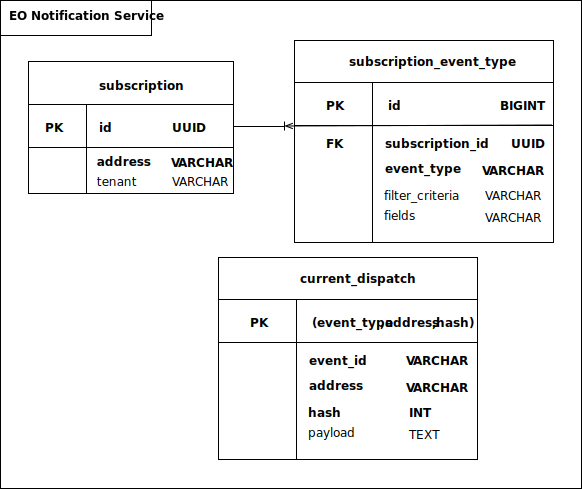

# Notification Service Maintenance

---

The following information includes details about configuring and maintaining the Notification Service. Information about the ENS database structure and the backing up and restoring of this database is also included. Finally, performance metrics that are collected from the ENS database, as well as a set of actual measurements is also detailed below. 

  - [Notification Service Configuration](#notification-service-configuration)
  - [Notification Service Database](#notification-service-database)
  - [Notification Service Performance Data](#notification-service-performance-data)

##  Notification Service Configuration

ENS is a service distributed as a docker image. You can run it using docker-compose. It is installed on a Kubernetes environment using a helm chart. The helm chart installs two replicas of ENS by default. 
 
The following table includes a description and the default value for all the environment variables that you can set by configuring them in the helm chart yaml files. 

| Variable name            | Default Value                 | Description                                                                                                 |
|--------------------------|-------------------------------|-------------------------------------------------------------------------------------------------------------|
| `KAFKA_ENABLED`            | true                          | This flag allows to enable/disable the Kafka driver, when alternative message-bus drivers are available.     |
| `KAFKA_NOTIFICATION_TOPIC` | "event"                       | The name of the Kafka topic used by ENS to read incoming events.        |
| `KAFKA_NOTIFICATION_GROUP` | "ericsson"                    | The name of the Kafka consumer group.             |
| `KAFKA_REPLICATION_FACTOR` | 3                             | The number of replicas of the topic maintained by Kafka for fault-tolerance and high availability. |
| `KAFKA_BOOSTRAP_SERVERS`   | eric-data-message-bus-kf:9092 | The name and the port of the Kafka service.                                                                       |
| `KAFKA_POOLL_TIMEOUT`      | 30000                         | The time (in milliseconds) Kafka waits for sufficient data to arrive from the network to fill the buffer.    |
| `KAFKA_SESSION_TIMEOUT`    | 30000                         | The time (in milliseconds) Kafka waits for heartbeat from ENS before kicking it off from consumer group.     |
| `REST_CONNECTION_TIMEOUT`  | 2000                          | The time (in milliseconds) ENS waits for a new client connection to be established before raising exception. |
| `REST_READ_TIMEOUT`        | 2000                          | The time (in milliseconds) ENS waits for a client read acknowledge before raising exception.                 |
| `RETRY_DELAY`              | 3000                          | The time (in milliseconds) ENS waits for a client to reply before triggering a retransmission.               |
| `RETRY_TIMES`              | 2                             | The maximum number of times ENS tries to send a notification to a client. |
| `MIN_DISPATCHING_THREADS`  | 4                             | The minimum number of notification dispatcher threads that are always alive and ready to send a notification. |
| `MAX_DISPATCHING_THREADS`  | 256                           | The maximum number of notification dispatcher threads.                                              |
| `THREAD_TIMEOUT`           | 60                            | The time (in seconds) ENS waits before removing an idle dispatching thread.   |

 Table 1 - Notification Service Environment Variables 

##  Notification Service Database

The Notification Service stores subscription information in the Postgres database to persist that information and have it available eventually, even after a restart. 

A table called `current_dispatch` is used to store outgoing notifications until they are delivered to the relevant clients. This way, ENS can resume sending the notifications after a restart without incurring the risk to duplicate or leak notifications.

The following diagram shows the database schema that is used to store notification service data.

The structure of the `current_dispatch` table is included below. 

| Field Name | Type    | Description & Purpose                                                                                                        |
|------------|---------|------------------------------------------------------------------------------------------------------------------------------|
| `eventID`    | String  | The unique Identifier of the event received from the Kafka message bus.                                          |
| `address`    | String  | The address of the destination client.                                                                                        |
| `hash`       | Integer | The hash of the payload to be delivered. If 0, the payload must be equal to the payload received from the message bus.   |
| `payLoad`    | String  | The payload to be delivered. It's null if identical to the payload in the event. |

 Table 2 - Schema of the `current_dispatch` Table 

**Important**: The `current_dispatch` table is excluded from the backup and restore process in order to avoid backing up temporary information that is no longer valid after restoring the existing database.

##  Notification Service Performance Data

The Notification Service is able to produce performance information about its operations. 

The following metrics are available at the /actuator/prometheus endpoint:

- **createsubscriptions.success**: Number of successful subscription creations
- **deletesubscriptions.success**: Number of successful subscription deletions
- **createsubscriptions.fail**: Number of failed subscription creations
- **deletesubscriptions.fail**: Number of failed subscription deletions
- **events**: Number of events consumed from Kafka topic
- **notifications.success.noretry**: Number of notifications successfully sent with no retries
- **notifications.success.retried**: Number of notifications successfully sent after retry
- **notifications.fail**: Number of notifications failed after configured retries
- **notifications.dropped**: Number of notifications dropped due to no match in filters
- **notifications.projected**: Number of notifications projected (payload shrinked to selected fields)
- **notifications.awaitingdispatch**: Number of notifications waiting to be dispatched
- **activesubscriptions**: Current number of active subscriptions
- **eventmantime**: Event management time

### Key Performance Indicators for Notification Service

The following KPIs are used:

| KPI                                                 | Value    | Measured limit  | Notes                                                                     |
|-----------------------------------------------------|----------|-----------------|---------------------------------------------------------------------------|
| Maximum number of concurrent subscription creations |	25       | 27              |                                                                           |
| Maximum time (in seconds) to process 25 subscription creations   | 3     |                 |                                                                           |
| Maximum number of concurrent subscription deletions | 25	     | 27              |                                                                           |
| Maximum time (in seconds) to process 25 subscription deletions   | 3    |                 |                                                                           |
| Maximum number of active subscriptions              | 50	     | No actual limit |                                                                           |
| Maximum time (in seconds) to retrieve all active subscriptions	  | 3     |                 | It depends on the number of subscriptions (No filtering/paging available) |
| Maximum event rate	                              | 60/hour  | ~ 100/sec       | In the case of "fast" clients                                                 |
| Peak event rate                                     | 120/hour |                 | Assuming the peak rate is sustained for a maximum of five minutes                 |

 Table 3 - Notification Service KPIs 

  
